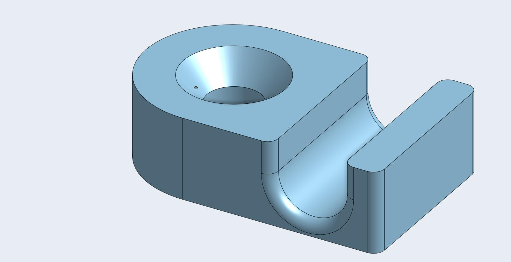

A little holder I made for DIY shelves for use with the IKEA IVAR shelves.

The original design is in OnShape:
https://cad.onshape.com/documents/c0a2c1ec6d9844d979dadd04/w/23fe1f247f6dd977a19c3905/e/cfa6b1a1f9ae21e7175fe731

Image of the part:

